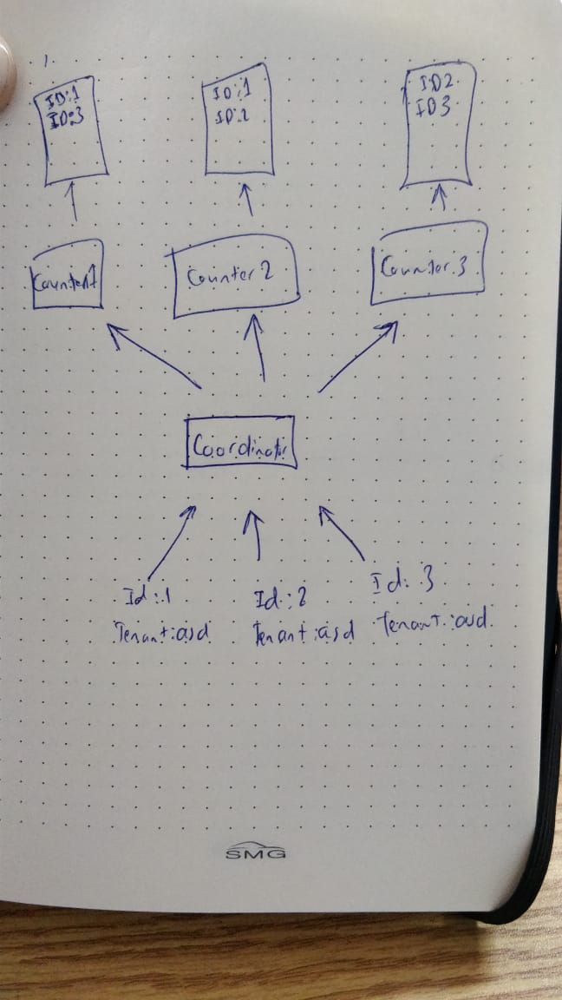

### Native distributed system with golang:


the current system implements the following structure



The base url is localhost:3000 

1. to build the images `docker-compose build`       
2. to the run the service `docker-compose up`
4. send data to the counter ```curl -X POST \
  http://localhost:3000/items \
  -H 'Cache-Control: no-cache' \
  -H 'Content-Type: application/json' \
  -H 'Postman-Token: 145e012c-3c04-40f8-817e-da681468850c' \
  -d '{
	"id":"5",
	"tenant":"asd"
}'```
5. to retrive tenant ```curl -X GET \
  http://localhost:3000/items/{tenant}/count \
  -H 'Cache-Control: no-cache' \
  -H 'Content-Type: application/json' \
  -H 'Postman-Token: 961089fb-019c-45d9-8bd3-b302a535343f' \
  -d '{
	"id":"2",
	"tenant":"asd"
}'```

----
### the risks with the current design

1. the objects get stored in the counters' memory, so image each counter has million records
2. the communication between the coordinator and the counter is in http which may face alot of packages loss and each connections down
3. if all the counters are down then the data is lost
4. lets say we have c1, c2 and c3. if c2 and c3 went down and the data came to c1 then c2, c3 came up again and this time c1 went down, then the data we have on c1 will not be retrived when querying

### to avoid the previous risks, we an use amqp with rabbitmq

the following image describes the implementation of such system


1. for every counter there is a queue with presistant option, so in counter failure, data is presisted in the queue until it is acknowledged
2. the queue will be fanout type so that all counters have the same data
3. each counter will count only the tenant received, in such case for a million record there will be only one map with those million record but the value is the count of tenant
4. when retriving from the counter to the coordinator the coordinator should return the greatest counter, because if one counter is down, its data are on the other counters


